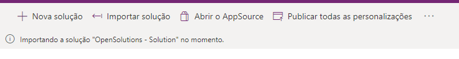

# Squad 01 - OpenSolutions

Submissão da Squad 01 - OpenSolutions para o Hackathon Open Finance do BTG Pactual

#btgfaztech

## Apresentação

A apresentação está no arquivo `OpenSolutions_Apresentacao.pdf`.

## Vídeo

O vídeo foi enviado ao YouTube e [está disponível neste link](https://www.youtube.com/watch?v=07AB0I5yPC0)

## Acessando a aplicação

Para acessar o app OpenSolutions, será necessário a importação da solução no ambiente PowerPlatform do BTG. Esse procedimento deve ser realizado por um administrador do Power Platform da Empresa.

Primeiro, clone o repositório para baixar o arquivo `.zip` da solução (`OpenSolutionsSolution_1_0_0_5.zip`). Acesse https://make.powerapps.com/ autenticado com login e senha do e-mail corporativo. Após isso, selecione um ambiente no menu superior direito e acesse **Soluções**.

Selecione **Importar solução**.

Adicione o arquivo `.zip` importado e clique em **Avançar** e **Importar**. Após isso, o processo de importação irá carregar na aba superior.

Feito isso, será necessário autenticar os conectores com as credenciais do Office e pronto, você já pode acessar o App da OpenSolutions.

Após acessar a solução, você pode testar ou editar o app através desse ambiente. 

